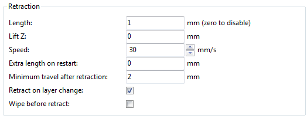

% Fighting Ooze

Unless the material being extruded has a very high viscosity it will
ooze from the nozzle in between extrusions. There are several settings
in Slic3r to which can help to remedy this.

The retraction settings, found in the `Printer` tab, tell the printer to
pull back the filament between extrusion moves. This can alleviate the
pressure in the nozzle, thus reducing ooze. After the subsequent travel
move the retraction is reversed to prepare the extruder for the next
extrusion.

 

-   `Length` - The number of millimeters to retract. Note that the
    measurement is taken from the raw filament entering the extruder. A
    value of between 1 and 2mm is usually recommended. Bowden extruders
    may need up to 4 or 5mm due to the hysteresis introduced by the
    tube.

-   `Lift Z` - Raises the entire extruder on the Z axis by that many
    millimeters during each travel. This can be useful to ensure the
    nozzle will not catch on any already laid filament, however it is
    usually not necessary and will slow the print speed. A value of
    0.1mm is usually sufficient.

-   `Speed` - The speed at which the extruder motor will pull back the
    filament. The value should be set to as quick as the extruder can
    handle without skipping steps, and it is worth experimenting with
    this value to find the quickest retraction possible.

-   `Extra length on restart` - Adds an extra length of filament after
    the retraction is compensated after the travel move. This setting is
    rarely used, however should the print show signs of not having
    enough material after travel moves then it may be useful to add a
    small amount of additional material.

-   `Minimum travel after retraction` - Triggering a retraction after
    very short moves is usually unnecessary as the amount of ooze is
    usually insignificant and it slows down the print times. Set the
    number of millimeters minimum distance the nozzle must move before
    considering a retraction. If the printer handles ooze well this can
    be increased to 5 or 6mm.

-   `Retract on layer change` - Movement along the Z axis must also be
    considered when dealing with oozing, otherwise blobs may occur. It
    is recommended to leave this setting on.

-   `Wipe before retract` - Moves the nozzle whilst retracting so as to
    reduce the chances of a blob forming.

Additionally there are several settings in the `Print` tab which can
help control oozing.

-   `Only retract when crossing perimeters` (Infill) - Tells Slic3r to
    only retract if the nozzle will cross the threshold of the current
    island being extruded. Slight ooze within the walls of a part are
    not seen and can usually be accepted.

-   `Avoid crossing perimeters` (Layers and perimeters - Advanced) -
    Will force the nozzle to follow perimeters as much as possible to
    minimise the number of times it must cross them when moving around,
    and between, islands. This has a negative impact on both G-code
    generation and print times.

-   `Seam position` (Layers and perimeters - Vertical shells) - This 
    setting determines the start point of perimeter loops, and thus the
    position of the potentially visible vertical seam on the side of the
    object. The available options are:
    * `Random` - This will choose a different point for each layer, thus
        making the seam less noticeable.
    * `Nearest` - This will try to choose a concave non-overhang vertex
        so that the seam is hidden in the inside of the concave angle. 
        If no concave non-overhang vertices are available, it will choose
        a convex non-overhang vertex. If none are available, it will 
        choose a non-overhang vertex. The choice among the candidates is
        operated so that the start point is the nearest to the previous
        extruder position. So this option will optimize for short travels.
    * `Aligned` - This will use the same logic as `Nearest` for finding the
        candidates, but it will choose the one that is nearest to the 
        start point of the previous layer. This will ensure the seam is
        mostly aligned throughout the whole object.
        

See also section : Sequential Printing
for another technique which can minimise strings forming between
objects.
